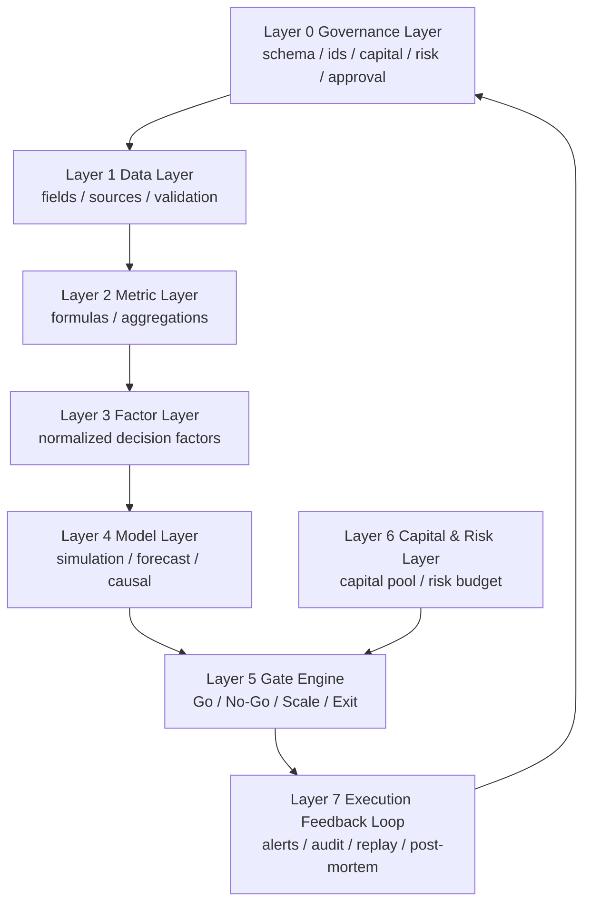

# Decision OS v1.0 Architecture

## 结构图

## 层间关系

### Governance -> Data

Governance 规定：

- ID system
- namespace
- schema version
- ownership
- approval chain

Data 层只能在这套规则内注册字段。

### Data -> Metric -> Factor

字段是最低可追溯单元，指标是可计算表达，因子是决策抽象。

这三层的强约束是：

- 因子不能直接引用原始字段
- 指标不能脱离字段而存在
- 字段不能没有来源和验证规则

### Model -> Gate

模型层输出：

- point estimate
- interval estimate
- risk metrics
- scenario outputs

Gate Engine 只读取标准化输出，不读取自由文本结论。

### Capital & Risk -> Gate

资本与风险层是硬约束。

即使模型方向乐观，只要：

- `required_capital > capital_free`
- `expected_drawdown > risk_limit`

Gate 也必须拒绝。

### Gate -> Feedback

Gate 的所有结果都要沉淀成：

- decision record
- audit trace
- failed conditions
- runbook action

## 工程建议

当前最适合的工程拆分是：

- `decision_os/`
  - YAML registry and templates
- `quant_framework/gate_engine.py`
  - rule evaluation runtime
- `quant_framework/reporting.py`
  - final report bridge
- `quant_framework/validation.py`
  - schema / rule / evidence checks
