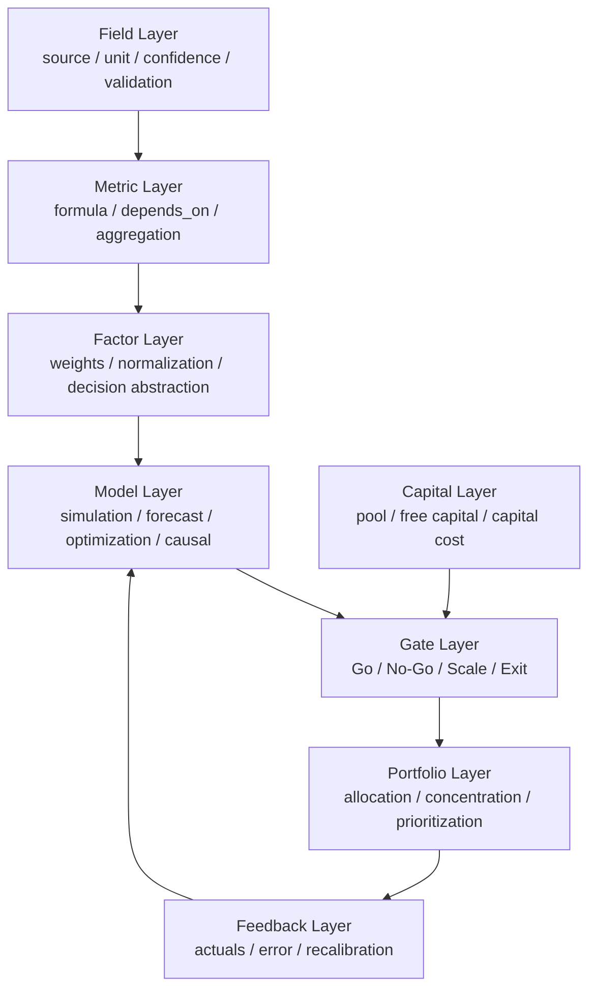

# Decision OS v2.0 Architecture

## 关系说明

- `Field -> Metric -> Factor -> Model` 是计算链
- `Capital -> Gate` 是硬约束链
- `Gate -> Portfolio` 是决策执行链
- `Portfolio -> Feedback -> Model` 是闭环校准链

## v2.0 核心变化

- Gate 不再只是单项目判断，而是投资组合约束的一部分
- Portfolio 成为一等模块
- Feedback 成为一等模块
