# Decision OS v3.0 Database ER Design

## Scope

This document defines the final production-oriented database structure for `Decision OS v3.0`.

Design principles:

1. All critical tables include `tenant_id`.
2. Key entities include `version`.
3. Master records use `is_active` for soft delete.
4. Monetary tables include `currency`.
5. All timestamps use UTC via `TIMESTAMPTZ`.

## Logical Domains

- `core_domain`
- `master_data_domain`
- `analytics_domain`
- `model_domain`
- `gate_domain`
- `capital_domain`
- `portfolio_domain`
- `audit_domain`

## ER Overview

```mermaid
erDiagram
    TENANT_REGISTRY ||--o{ USER_REGISTRY : owns
    TENANT_REGISTRY ||--o{ SKU_MASTER : owns
    TENANT_REGISTRY ||--o{ CHANNEL_MASTER : owns
    TENANT_REGISTRY ||--o{ SUPPLIER_MASTER : owns
    TENANT_REGISTRY ||--o{ FIELD_REGISTRY : scopes
    TENANT_REGISTRY ||--o{ METRIC_REGISTRY : scopes
    TENANT_REGISTRY ||--o{ FACTOR_REGISTRY : scopes
    TENANT_REGISTRY ||--o{ MODEL_REGISTRY : scopes
    TENANT_REGISTRY ||--o{ GATE_REGISTRY : scopes
    TENANT_REGISTRY ||--o{ CAPITAL_POOL : scopes
    TENANT_REGISTRY ||--o{ RISK_BUDGET : scopes
    TENANT_REGISTRY ||--o{ PORTFOLIO_REGISTRY : scopes
    TENANT_REGISTRY ||--o{ AUDIT_LOG : scopes

    FIELD_REGISTRY ||--o{ METRIC_DEPENDENCIES : feeds
    METRIC_REGISTRY ||--o{ METRIC_DEPENDENCIES : depends_on
    METRIC_REGISTRY ||--o{ FACTOR_COMPONENTS : aggregates
    FACTOR_REGISTRY ||--o{ FACTOR_COMPONENTS : composes
    FACTOR_REGISTRY ||--o{ FACTOR_VALUES : materializes
    FACTOR_REGISTRY ||--o{ MODEL_INPUTS : inputs
    MODEL_REGISTRY ||--o{ MODEL_INPUTS : consumes
    MODEL_REGISTRY ||--o{ MODEL_RESULTS : produces
    GATE_REGISTRY ||--o{ GATE_CONDITIONS : configures
    GATE_REGISTRY ||--o{ DECISION_LOG : produces
    CAPITAL_POOL ||--o{ DECISION_LOG : constrains
    RISK_BUDGET ||--o{ DECISION_LOG : constrains
    DECISION_LOG ||--o{ EXECUTION_FEEDBACK : receives
    PORTFOLIO_REGISTRY ||--o{ PORTFOLIO_POSITIONS : contains
    USER_REGISTRY ||--o{ DECISION_LOG : approves
    USER_REGISTRY ||--o{ AUDIT_LOG : acts
```

## Domain Tables

### Core Domain

- `tenant_registry`
- `user_registry`

### Master Data Domain

- `sku_master`
- `channel_master`
- `supplier_master`

### Field Domain

- `field_registry`

### Analytics Domain

- `metric_registry`
- `metric_dependencies`
- `metric_values`
- `factor_registry`
- `factor_components`
- `factor_values`

### Model Domain

- `model_registry`
- `model_inputs`
- `model_results`

### Gate Domain

- `gate_registry`
- `gate_conditions`
- `decision_log`
- `execution_feedback`

### Capital and Risk Domain

- `capital_pool`
- `capital_allocation_log`
- `risk_budget`
- `risk_exposure_log`

### Portfolio Domain

- `portfolio_registry`
- `portfolio_positions`

### Audit Domain

- `audit_log`

## Validation Rules

1. A decision cannot exist without a tenant-scoped gate.
2. Model results must be tenant-scoped and versioned.
3. Capital and risk snapshots must be explicitly versioned.
4. Audit logs are append-only and hash-linked.
5. Feedback records must reference an existing decision.
